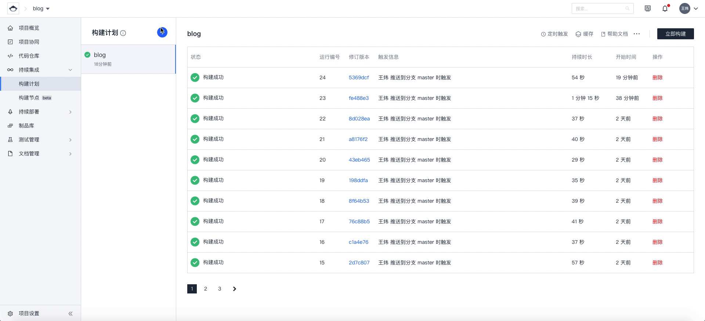

# 背景
为了让大家体验 CODING CD 的功能以及存放内部技术分享文章，为此建立了这个项目。

# 准备
1. 腾讯云 TKE 集群
2. 开通 CODING CD 功能
3. 代码仓库：https://wangweicoding.coding.net/p/blog/d/blog/git

# 实现效果


# 步骤
## 1. TKE 集群配置以及 CODING 配置
将 TKE 集群开放外网访问以及将凭据添加到 CODING


## 2. 在 CODING 控制台创建构建计划，用来生产制品

Jenkinsfile 已定义，主要实现了生成静态页面以及推送制品到镜像仓库。



```
pipeline {
  agent any
  stages {
    stage('检出') {
      steps {
        checkout([
          $class: 'GitSCM',
          branches: [[name: env.GIT_BUILD_REF]], 
          userRemoteConfigs: [[url: env.GIT_REPO_URL, credentialsId: env.CREDENTIALS_ID]]
        ])
      }
    }
    stage('生成静态页面') {
      steps {
        script {
          sh 'npm install -g hexo-cli'
          sh 'npm install'
          sh 'hexo g -d'
        }
      }
    }
    stage('构建') {
      steps {
        echo '构建中...'
        script {
          // 请修改 dockerServer、dockerPath、imageName
          dockerServer = 'wangweicoding-docker.pkg.coding.net'
          dockerPath = '/blog/blog'
          imageName = "${dockerServer}${dockerPath}/blog:${env.GIT_BUILD_REF}"
          def customImage = docker.build(imageName)
 
          // 推送 Docker 镜像到仓库
          docker.withRegistry("https://${dockerServer}", CODING_ARTIFACTS_CREDENTIALS_ID) {
            customImage.push()
          }
        }
      }
    }
  }
}
```

## 3. 前往 Spinnaker 控制台部署创建应用

配置用于部署 Hexo 的 Pipeline，项目已准备好 deployment 和 service

> deploy.yaml

```
apiVersion: apps/v1
kind: Deployment
metadata:
  name: blog
  namespace: blog
  labels:
    app: blog
spec:
  replicas: 2
  selector:
    matchLabels:
      app: blog
  template:
    metadata:
      labels:
        app: blog
    spec:
      containers:
        - name: blog
          image: wangweicoding-docker.pkg.coding.net/blog/blog/blog
          ports:
            - containerPort: 80
      imagePullSecrets:
      - name: dockersecret
```

> service.yaml

```
apiVersion: v1
kind: Service
metadata:
  name: blog
  namespace: blog
spec:
  selector:
    app: blog
  ports:
    - protocol: TCP
      port: 80
      targetPort: 80
  type: LoadBalancer
```


> 注意：deployment 文件内使用了 imagePullSecrets ，配置部署前请使用以下方法提前创建

```
kubectl create secret docker-registry myregcred \
     --docker-server=<your-registry-server> \
     --docker-username=<your-name> \
     --docker-password=<your-password> \
     -n namespace
```


## 4. 发布文章
将 Markdown 文件放在项目 `source/_posts/` 目录下，如果有图片，可以在同级 `static` 目录下新建一个用于存放自己文章的目录，并将图片放在此位置，注意 Mrakdown 引用时使用相对路径引用，提交到 git 仓库后，图片会自动上传到 cos 上，并替换文章的图片内容，每次发布文章，像代码一样提交 MR 即可。